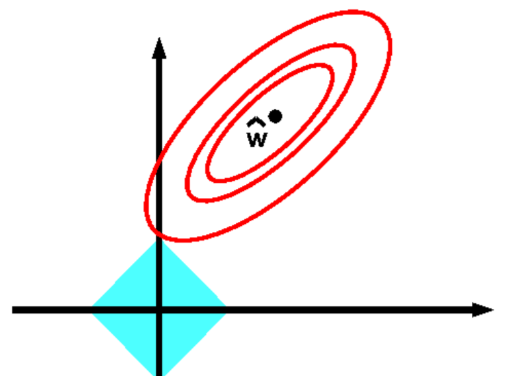

## Regularization

Aims to reduce overfitting in a model, by reducing variability in weight magnitude

### Prereq Notes.

#### Scalar Field

**Scalar Field** is a mathematical function that assigns a single scalar to every point in a given space.

```math

f: \mathbb{R}^n \rightarrow \mathbb{R}

```
A type of scalar field is the LP norm, where it exactly defines the above as:

```math

f: \mathbb{R}^n \rightarrow \mathbb{R}, f(\vec{x}) = ||\vec{x}||_p

```

#### Isosurface

**An Isosurface ($\mathbb{R}^n, n > 2$) or Isoline ($\mathbb{R}^n, n ≤ 2$)** denotes the set of points for for which a specific function has a constant value.

For the $L_1$ norm, this forms a diamond, $|x_1| + |x_2| = c$

If we have $\vec{x} = (3, 5)$, $c = 8$ and then the isoline defined by the $L_1$ norm is a diamond with the points on the isolines an $L_1$ distance of $8$, away from the origin.

The isoline denotes all $\vec{x} \in \mathcal{X}$ where $|| \vec{x} ||_1 = 8$.

$\mathcal{X}$ is the metric space, the set of all $\vec{x}$ defined by the $L_1$ where the level set is $8$

### L1 Regularization

> [Implementation](implementations/02-L1nn.py)

Mechanistically works the same as L2 (see below), but instead takes the absolute value of the magnitude of weights, rather than squaring it, as it is based on the $L_1$ norm.

**$L_1$ norm** has the isolines with the property that increases in a given coordinate, say $x_1$, are offset by decreases of equivalent magnitude to $x_2$ to yield the same level set of the given $L_1$

Their isolines can be seen as a diamond, each point on the isoline, equidistant from the origin.

Thereby, when the $L_1$ norm is applied onto gradient descent, your minimum loss is constrained to the level set of the current $||\phi||_1$, say $c$, multiplied by your regularization parameter $\lambda$ and the set of $\phi$ that satisfy $c$.

```math
\hat{\phi} = \text{argmin}_{\phi}[\sum_{i = 1}^I l_i[\phi_i, y_i] + \lambda||\phi||_1]
\\[3mm]
\hat{\phi} = \text{argmin}_{\phi}[L(\phi, Y) + \lambda ||\phi||_1]
```

If $L(\phi, Y)$ is $0$, the minimum value of the loss is the $L_1$ norm (or level set) of $\phi$ multiplied by $\lambda$. The set of parameters, $\phi$ can only be minimized to the degree that they yield minimum of the loss while still meeting the $L_1$ norm.

Typically, this promotes sparsity as the $\text{argmin}_{\phi}$ of the loss with $L_1$ regularization lies on the direction of a a single axis of the $\mathbb{R}^n$ space given by $\phi$. Purely considering $\mathbb{R}^2$, this is as nearest point to the true minima of the loss on the isolines of the $L_1$ is typically $(c, 0), (0, c), (-c, 0), (0, c)$ where $c$ is the level set for $\phi$.

Can be geometrically interpreted as:

<br/>
<div align = center>

</div><br/>

Though, this is not always the case and is dependent on the construction of the loss function and the location of the minima. If the minimia is closer to an axis, then it's likely that $L_1$ regularization will promtoe sparsity.


The gradient of $L_1$ is simply $\lambda \text{sign}(\phi)$. This might cause instability if all $\phi$ are 0, as $∂|0|$ is undefined, but is extremely rare, especially given that all $\phi$ are randomly initialized (xavier init. for ex.). We coudl also use subgradients, where $∂|0|$ is just $0$.

### L2 Regularization

> [Implementation](implementations/01-L2nn.py)

L2 regularization punishes the sum of squares of the parameter values, or the squared norm of the weight matrix. The larger this value gets, the more regularization is applied.

The isolines (isocurve?) defined by the $L_2$, rather than forming a diamond like the $L_1$ norm, are instead shaped as a circle. Thereby, the minimum level set that also minimizes the loss, may not lie on an axis and thereby your parameters, $\phi$ have a decreased probability to bring about sparsity.

Rather than minimizing the loss as regular, we compute instead:

$\hat{\phi} = argmin_{\phi}[\sum_{i = 1}^I l_i[x_i, y_i] + \lambda ||\phi||^2]$

with the added $\lambda \sum_j \phi_j^2$ as the term that increases the loss, dependent on the magnitude of params, $\phi$.

Larger values of $\phi$ typically indicate overfitting, as the output varies more when certain $\phi$ are activated and used in the weighted sum, while others are not.

> Remember that high variance in the test set of the neural network indicates that the model is overfitting to the training set.

Adding the penalty term to the loss function, and then during backpropagation as $2\lambda\phi$ (the $∂$ is a weight vector, not the norm of weights.), increases the magnitude of the gradient and in the update step, as we're subtracting the $\alpha g_t$ from $\phi$, we force $\phi$ to become smaller given that we're adding an extra penalty to the gradient, $g_t$, purely based on the magnitude of the weights.

Thereby, as weights are larger, we perform larger weight updates to keep them smaller.

> *Typically, L2 is incorrectly known as weight decay but there's a large difference. Weight decay adds the penalty directly to the weight update as:*

```math

\phi = \phi - \alpha g_t - 2\lambda\phi\\[3mm]

\text{or}\\[3mm]

\phi = \phi - \alpha g_t - \lambda\phi\\[3mm]

\text{iff you're factoring in the added} \hspace{1mm}\frac{1}{2} \hspace{1mm}\text{constant to the loss func, then it WOULD become,}\\\text{for mathematical convenience of the partials:}\hspace{1mm}\\[3mm]

\hat{\phi} = argmin_{\phi}[\sum_{i = 1}^I l_i[\phi_i, y_i] + \frac{1}{2}\lambda ||\phi||^2]\\[3mm]

\text{but of course, we don't add the constant to the loss func,}\\[3mm]
\text{as we'd need to take it's gradient, which we don't want in weight decay}\\[3mm]
\text{but we can still add the constant, as IF we were adding in the constant in the loss func.}

```

> *While for SGD the difference between L2 and weight decay might not matter as much, in different varations of optimziers like Adam, RMSProp, or Momentum, this can become fallible as we compute first / second moments based on the gradients. This is why AdamW came along to propose that we use weight decay purely instead of L2 Regularization for other optimizers besides vanilla SGD*

### Dropout

> *[Paper](https://www.cs.toronto.edu/~rsalakhu/papers/srivastava14a.pdf)*
> *[Implementation](implementations/03-np-dropout.py)*

Dropout, via probability $p$, typically in the range between $.2$ to $.5$, , is used to regularize a neural network by randomly dropping (zeroing out) a set of neurons in the given $lth$ layer of the model, based on $p$, during each iteration of gradient descent.

The set of neurons that are dropped, then do not contribute to the final output activations and the argmaxed predictions ( if we use softmax).

Dropout works as:

```math

z^l = w^l \cdot y^{l-1} + b^l
\\[3mm]
y^l = f(z^l)
\\[3mm]
r^l \sim \text{Bernoulli}(p)
\\[3mm]
\hat{y}^l = r^l \odot y^l
\\[3mm]
z^{l+1} = w^l \cdot y^{l-1} + b^l
\\[3mm]
y^{l + 1} = f(z^{l+1})
\\[3mm]
\text{Repeat for all }L\text{ layers, where }l_i \text{ is the desired layer of neurons to dropout.}

```

where $\text{Bernoulli}$ is defined as:

```math

P(n) = \begin{cases} p, \hspace{1mm}n = 1 \\ 1 - p,\hspace{1mm} n = 0 \end{cases}

```

At test time, we compute inference with no dropped neurons, all are active, but the the set of learnt weights / trained neurons are scaled by $p$, via a simple multiplication as $pw$. 

The rationale for this is as follows: 

Supposed $p = .5$, then on expectation, half your neurons are dropped out at each forward pass of training, if dropout is applied to all layers.

Thereby, to get the final prediction $\hat{Y}$, the set of dropped neurons have to work twice as hard ( have twice the magnitude of values ), to achieve the same $\hat{Y}$ when compared to if you trained your neural network with no dropped weights.

Given that we're performing inference on our neural network with ALL weights and neurons active, we multiply each weight by $p$, in this case $.5$, to reduce the magnitude of the final $\hat{Y}$ to the magnitude of values that the neural network was trained on. Otherwise, the final $\hat{Y}$ may have about twice the size that we desire, then the model would return an extremely high loss value resulting in erroneuous results (unless you perform Monte Carlo Dropout).

Otherwise, another option is to perform inverted dropout, where this time we scale the droput mask, $r$ by a division by $p$. This results in the original $1$ values of the dropout mask, to become slightly higher, and when multipled by activations $y$, then scales them up by $1 / p$, for the neurons that weren't dropped. Then, the trained weights aren't subject to being forced to have a higher magnitude to get the same $y$. Essentially, performs the same computation as regular dropout, but perhaps more efficient and streamlined.

Essentially, when training deep neural networks, it's likely that certain parameters will become dependent on another, especially when overfitting, as certain neurons learn specific features that others won't.

Thereby a neuron $w_{ij}$, say $w_{31} \in W$, may skew the output activation to an extremely large positive value, while then to maintain the correct output and minimize the value of the loss, another neuron, $w_{32}$, will have to error correct and bring down the skewed value brought upon by $w_{31}$ by taking on an extremely large negative value.

In this sense, $w_{32}$ has become dependent on $w_{31}$.

It also may be possible that the third neuron in that $ith$ layer, $w_{33}$, plays no role, or at least a very weak role, in the final correct activation output as $w_{31}$ is already balanced out via $w_{32}$ to get the final correct activation output. $w_{33}$ is very weak, all due to the dependencies that $w_{31}$ and $w_{32}$ have learnt.

They are all dependent on one another.

This is the co-adaptation of neurons, which Srivastava et al., sought to reduce via Dropout.

Dropout can be seen as near equivalent to $L_1$ or $L_2$ regularization in the sense that they both aim to reduce the magnitude of the weights, to a near equivalent value, but there are some important differences.

Dropout is more stochastic. While in $L_p$ regularization, you could define your $\lambda$ and restrict your weights to the specific level set you desire, based on your be. hypothesis on what the $L_p$ magnitude of the weights will be, you don't know what the magnitude of your weights will be via Dropout and can't directly determine them via Dropout. 

> Though a good heuristic can be, the larger the value of $p$, the higher the magnitude of your weights might be, as neurons have to work harder the more some are dropped.

Dropout also **trains** the subset of neurons that **aren't** dropped. This means that the subset of neurons can learn to represent features of a given sample **on their own**. Thereby, you're essentially creating an ensemble of neural networks within your larger model, enabling predictions to become more robust. $L_p$ regularization makes use of **all** neurons, while in dropout, the entire model might not neccesarily need them all to make a good prediction for a single sample.

