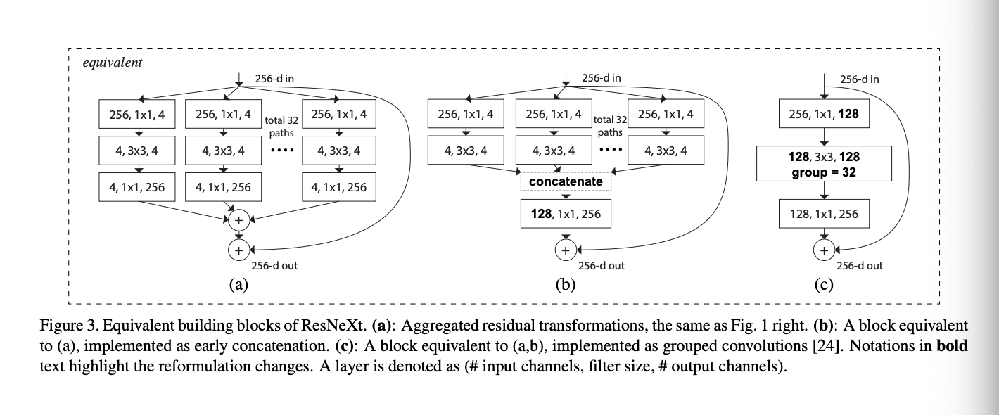

# ResNext

*An extension of ResNet, this time using parallelized grouped convolutions, similar to Inception, but the convolutions are symmetric across their branches / groups*.

> *Their groups, $g$, they call cardinality, $C$*.

**Initial Thoughts**

Given that sequential processing of a Neural Network can lead to slower learning and a narrow set of learned features, parallelizing convolutions makes sense as you have multiple unique $\mathcal{K}$, each applied onto seperate divided groups of the input, such that you learn different features which are more diversified, with less computation.

This also makes sense as I can decrease the amount of convolution ops, while **still increasing diversification of learned features**

Considering the following,

- 64 Input Channels
- 8 Groups / 8 Channels per Groups
- Each Group has 10 Output Channels
- Total is 80 Output Channels for this Residual Block.

```math

\mathcal{O}(8 \cdot 10 \cdot 8) = \mathcal{O}(640) = 640 \text{ convops}

```

If I did purely:

- 64 Input Channels
- 80 Output Channels

without Groups, then,

```math

\mathcal{O}(8\cdot 64) = \mathcal{O}(5120) = 5120 \text{ convops}

```

> This doesn't include computational cost across spatial dimensions, but it's clear that the former will win over the latter in terms of efficiency.

### Introduction

- Given inception modules, their construction of using lower dimensional embeddings via smaller $\mathcal{K} \in \mathbb{R}^n$ within separate branches, to represent / replace a larger $\mathcal{K}$, call it $\hat{\mathcal{K}} \in \mathbb{R}^m$, shows that the solution space is an $\mathbb{R}^n$ subspace of $\mathbb{R}^m$.

- The important property of this is high accuracy with a lower computational cost relative to models like VGG, given that we remain $\in \mathbb{R}^n$
- But Inception is highly specialized, such that it might not be straightforward to adapt the architecture to other tasks.
- We introduce an architecture, that adapts VGG / ResNet of repeating layers while using the multi-branched paralellized convolutions by Inception, combined with residual connections ($\mathcal{R}$).
  - Their branched convolutions are of same dimension for all other parallel branch, such that their modules don't need to be high specialized and can be generalized across multiple scenarios
- They outperform ResNet, while still maintaiing computational complexity and model size.

### Related Work

- Grouped Convolutions can date back to AlexNet, where parallelizing AlexNet on 2 GPUs isolated several $\mathcal{K}$ from one another, such that they learnt distinct features. It isn't new.
 
> The extrema to introducing cardinality is a Depthwise (a.k.a channelwise) convolution, such that $\text{cardinality} = 1$, each input channel has a separate and unique $\mathcal{K}$. Of course, to increase expressiveness of the network after each depthwise convolution, we can use multiple $1 \times 1$ convolutions to aggregate the features such that we learn the relationships across multiple feature maps, not leaving the information isolated from one another. Combinining the former with the latter, we now have a depthwise seperable convolution.

### Method

- A design inspired from VGG and ResNets is adopted.
- Their residual connections have the same structure as ResNet and is inspired by the rules followed by VGG / ResNets
  - If over several layers, the output size remains the same, then for $\mathcal{K}$, we maintain the same hyper-params -- indicating same width and filter size and stride and etc.
    - Eliminating complexity of constructing a "specialized" block, unlike shown in Inception.
  - If a spatial map is dowmsampled by a factor of $2$, the widths of the network is multipled by $2$ -- half the size, twice the output feature maps, via twice $\mathcal{K}$.
    - Ensures computational complexity is the same for all blocks.

**3.2**

Revisiting simple neurons, where we have $\sum_{i = 1}^D w_i x_i$, they introduce $\sum^C_{i = 1} \mathcal{T}_i(x)$, where the transformation $\mathcal{T}$ is applied onto a group of $x$, projecting it into a lower dimensional space and the transforming it (referring to depthwise seperable convolutions with varying degrees of cardinality, $C$)

> Apply the convolution operation for all $g$ groups, up to $C$ (cardionality), then recombine via $1 \times 1$ convolutions. This is the essence of their version of depthwise seperable convs, via $\mathcal{T}$.

- They set all $\mathcal{T}$ to be of the same topology for simplicity ( uniformity in convolutions across branches of their module ).

They construct $\mathcal{T}$ as:

<div align = 'center'>

</div>
<br>

The $1 \times 1$ convolution produces the low dimensional embedding, which then has the features extracted by the $3 \times 3$ convolution. Then, a pointwise ($1 \times 1$) convolution is used to learn the relationships of the features across the multiple outputs of each groups (aggregating together the learnt features).

Afterward, the aggregation output, from the $1 \times 1$ convolution is then passed onto the next block, and also passed on to the output of the next block to be concatenated , via the residual connection.

- The concatenation or grouping of convolutions really only makes sense where $\mathcal{T}$ is homogeneous, otherwise concatenation / grouping of convolutions wouldn't make sense as the dimensionality wouldn't match.

### Experiments

- Going Wider increases Accuracy more than going deeper does, as shown in comparisons of ResNet-200 ($1 \times 64\text{d}$) vs ResNeXt-101 ($64 \times 4\text{d}$)
  - First term is cardinality, $C$, second term is the width of the bottleneck layer (number of input channels to each of the $g$ groups $\in C$).
- Increasing $C$ is more effective than increasing the width ($d$) of the network, as they achieve a greater improvement in accuracy when they do so.