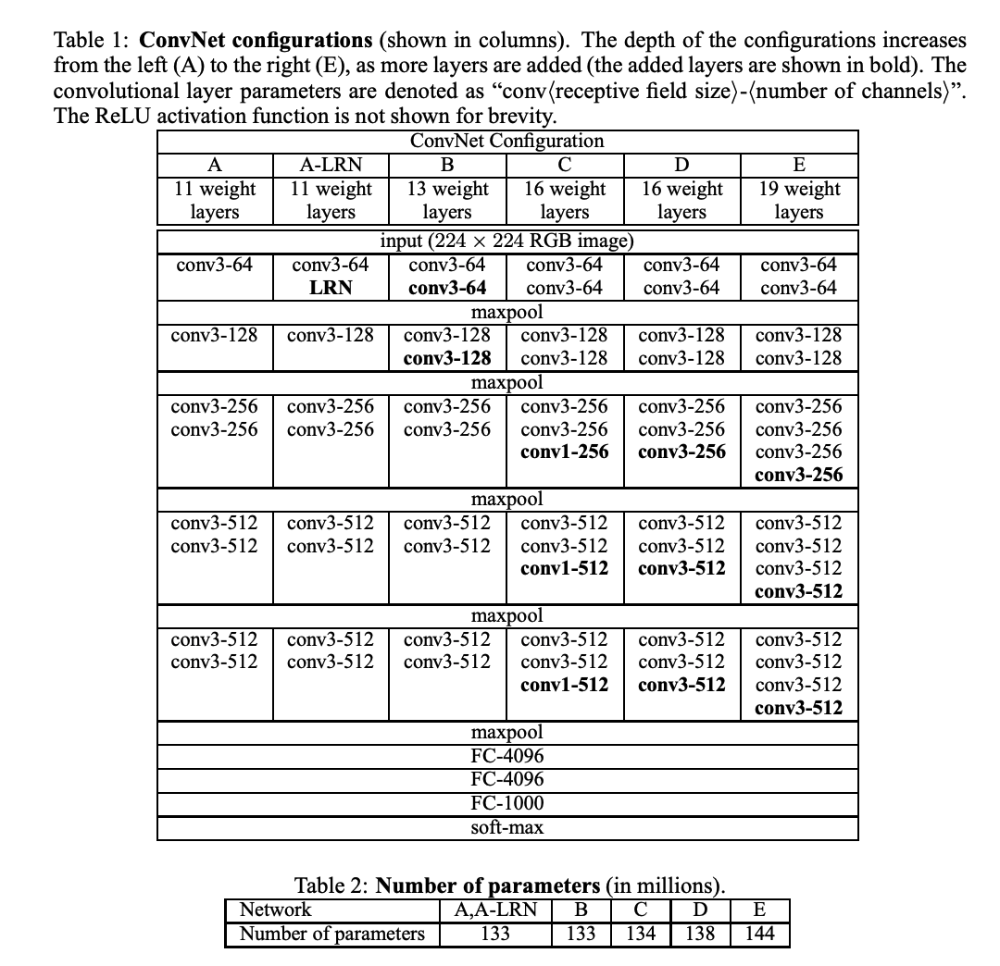

TODO

- [ ] How was this generaliezd to other architecturse / tasks?

# VGG

Basic flow of a CNN is:

1. Conv Layer with Padding (prevent downsampling)
2. Activation Function (typically ReLU)
3. Pooling Layer

Proves to be inefficient for constructing deep networks as your resolution decreases very quickly, on the order of $log_2d$, where $d$ is a dimension of a square input image.

Alexnet: $log_2d, d = 227 \rightarrow 7.82654\dots$, no more than 7 layers!

VGG proposed that more convolutions with smaller $\mathcal{K}$ would provide better results than less convolutions with larger $\mathcal{K}$.

With VGGNet, they proved this to be true.

> *Likely due to the hierarchical nature of CNNs to extract more important features as we get deeper.*

Their VGG block is a sequence of $3 \times 3$ convolutions, with $p = 1$ to keep dimensionality, followed by a $2 \times 2$ max pooling layer with $s = 2$, halving the height and width after each block

> *AlexNet did this, without formally popularizing it at the end of their convolutional block, prior to fc layers. With the difference that their max-pool was $3 \times 3$*

Each VGG Block retains the same amount of output channels for all convolutions, each block only has a single output channel count defined.

**Initial Thoughts:**

*Seems as if VGG extracts more locally defined features from the original image ($3 \times 3$ convs) directly from the input, their receptive field is extremely small for the first couple of layers.*

*But the deeper the model goes, the larger the receptive field becomes.*

*The trade-off seems to be:* 

*You can build models with smaller $\mathcal{K}$ with deeper layers. You can also build shallow models with larger $\mathcal{K}$. Both might have larger receptive fields. But the former is able to hierarchically extract increasingly complex features while the latter might be limited by higher level features.*

## VGG Paper

### **Abstract**

- Increase depth via $3 \times 3$ convolutions
- THey secured first and second place in ImageNet tasks (localization and classifiaction, respectively)

### Configurations

#### Architecture and Configs

- Input is $224 \times 224$ image
- Only pre-processing is normalizing to mean = 0
- They VGG Block is $3\times 3$ convolutional layers with a non-linearity followed. 
  - In one of the configurations they use a $1 \times 1$ convolution, essentially mimicking an FC layer.    
  - Stride is fixed to $1$
  - Conv padding is set to preserve dimension, as $p = \frac{k-1}{2}$ where $k$, the kernel size is odd.
    - By convention, $k$ is always typically odd.
  - At the end of each VGG Block, there is a single $2 \times 2$ max pooling layer with stride $2$, such that dimensionality of the feature map is halved.
- FC layers are same as AlexNet: ($4096, 4096, 1000$), where the $1000$ denotes softmax classification for ImageNet.
- All layers have ReLU, besides output softmax layer.
   - Their ConvNets (besides one variation) don't contain Local Response Normalization

#### Discussion

- A $2$-layer stack of $3 \times 3$ convolutions with $s = 1$ has a receptive field equivalent to a single layer of a $5 \times 5$ convolution. The former typically performs better than the latter as more features can be hierarchically extracted via 2 non-linearities, one at each layer ($\text{ReLU}$).
  - You do this with a smaller set of parameters, a single $5 \times 5$ holds $25 \cdot C_{in} \cdot C_{out}$ number of parameters while the 2 stack of $3 \times 3$ holds $2(3^2C^2)$
  - This creates a form of regularization, where we're reducing the number of parameters, hence reducing the likelihood of overfitting on a dataset.
- $1 \times 1$ convolutions in their configuration, $\text{C}$, are used to increase the non-linearity of the final classification, such that the model is able to increase the degree of non-linearity without affecting the spatial dimension of the receptive field within the given VGG Block.
- $W$ was randomly initialized for the shallow model, $A$, but for deeper models, $W$ was initialized drawing directly from $A$.
  - This was done due to the vanishing / exploding gradient problem, such that initializing from $A$ would start weights at a state where vanishing / exploding gradients are mitigated. 
  - It was realized after the paper, that they can purely initialize using Xavier Init. as $W \sim \mathcal{N}(0, \frac{1}{n_{in}})$ to maintain the $\text{Var}$ even across all layers.

### Classification Framework

#### Training

- Batch Size is $256$
- Momentum is $.9$
- Regularized via weight decay, with decay parameter set to $.0005$
- Dropout used for first $2$ FC layers, with $p = .5$
- Learning Rate is $.1$ on a step schedule, decreasing by a factor of $10$ everytiome validation accuracy stopped improving.
- For a single-scale trained model, they set the smallest size of a given image to $S$ and then cropped a $224 \times 224$ portion of the given image. $S = 256$ and $S = 384$ were both considered.
- For multi-scale training, images were stochastically augmented by choosing a given $S$, randomly sampling between $[S_{min}, S_{max}]$ and then reducing the smallest side of a given image to be $S$. Then a central $224 \times 224$ crop was taken from the image. This approach was only used via fine-tuning on multi-scale images, where the pretrained model was trained purely using a fixed $S = 384$
  - Just like AlexNet, they also used random transformations such as shifting, rotations, and $\text{PCA}$ based image augmentation.

### Other

- Downsampling via convolutions always means you preserve some degree of information, given that you're using $\mathcal{K}$. Downsampling with max-pooling means you're losing out information but taking the $\text{max}$ value.
- Note that a $2 \times 2$ convolution or pooling layer with stride $2$ will decrease the image dims by half.