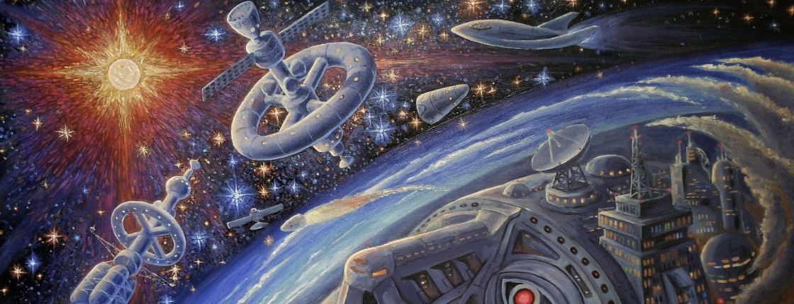

  

# Learning Arc

Convoluting $\eta$-dimensional tensors over abstract manifolds.

This is based on my learning arc, which you can check out [here](https://vxnuaj.notion.site/Learning-Arc-1025f1989c4f80539f65f688c2c0a251) or [down below](#learning-arc)!

PLEASE - if you see any slop, my errata, please raise an issue or create a pull request! 

Questions? Message me on [X (formerly twitter) @ vxnuaj](https://x.com/vxnuaj)!

## Nav

- [Learning Arc](#learning-arc)
  - [Nav](#nav)
  - [Index](#index)
  - [Path](#path)
    - [Recap to Neural Networks](#recap-to-neural-networks)
    - [**CNNs**](#cnns)
    - [RNNs](#rnns)
    - [Attention \& Transformers](#attention--transformers)

## Index

1. [Intro / Recap to Neural Networks](intro-to-nnet)
   1. [NOTES | NYU Lecture: History, motivation, and evolution of Deep Learning](intro-to-nnet/01-nyu-1.md)
   2. [NOTES | Chapter 3 of Understanding Deep Learning](intro-to-nnet/02-Chap3UDL.md)
   3. [NOTES | Chapter 4 of Understanding Deep Learning](intro-to-nnet/03-Chap4UDL.md)
   4. [NOTES | Chapter 5 of Understanding Deep Learning](intro-to-nnet/04-Chap5UDL.md)
   5. [IMPLEMENTATION | Neural Net from Scratch in Jax](intro-to-nnet/06-nn-jax.py)
   6. [IMPLEMENTATION | Neural Net from Scratch in NumPy](intro-to-nnet/06-nn-np.py)

## Path

*Last updated 9/23/2024*

> *I wrote this on my own, with the help of resources + GPT. Take it all with a grain of salt.*

ChangeLog

09/23/2024

        
After feedback from a research engineer at XAI, reframed my entire process. 
        
Thank god X exists.
        

 Resources 

https://udlbook.github.io/udlbook/

https://www.deeplearningbook.org/

https://cs231n.stanford.edu/

https://atcold.github.io/NYU-DLSP20/

- Extra
    - http://ufldl.stanford.edu/tutorial/supervised/FeatureExtractionUsingConvolution/
    - https://stanford.edu/~shervine/teaching/cs-230/cheatsheet-convolutional-neural-networks
    - https://srdas.github.io/DLBook/ImprovingModelGeneralization.html
    - https://colah.github.io/

### Recap to Neural Networks

  
Foundations

  
  - NYU Week 1
      - [x] [NYU Week 1 Video](https://www.youtube.com/watch?v=0bMe_vCZo30&list=PLLHTzKZzVU9eaEyErdV26ikyolxOsz6mq&index=2&t=4939s)
      - [x] [NYU Week 1 Notes 1](https://ebetica.github.io/pytorch-Deep-Learning/en/week01/01-1/)
      - [x] [NYU Week 1 Notes 2](https://ebetica.github.io/pytorch-Deep-Learning/en/week01/01-2/)
  - [x] 3.X (Shallow Neural Networks) of [UDL Book](https://udlbook.github.io/udlbook/)
  - [x] 4.X (Deep Neural Networks) of [UDL Book](https://udlbook.github.io/udlbook/)
  - [x] 5.X (Loss Functions) of [UDL Book](https://udlbook.github.io/udlbook/)
  - [x] Review K-Fold Cross Validation
  - [x] Build a Vanilla Neural Network on Fashion-MNIST using Jax, using K-Fold Cross Validation
  - [x] Build a Vanilla Neural Network on Fashion-MNIST using PyTorch, using K-Fold Cross Validation.

  
Optimization

  > **We will be reviewing Optimizers.** As each is learned, each will be implemented in NumPy and PyTorch on Fashion MNIST.

  - [Optimization and Deep Learning](https://d2l.ai/chapter_optimization/optimization-intro.html)
    - 12.1 Optimization and Deep Learning
        - [ ] Complete Module
    - 12.2 Convexity
        - [ ] Complete Module
    - 12.5 Minibatch Gradient Descent
        - [ ] Complete Module
        - [ ] Implement in NumPy
        - [ ] Implement in PyTorch
    - 12.6 Momentum
        - [ ] Complete Module
        - [ ] [Distill - Momentum](https://distill.pub/2017/momentum/)
        - [ ] Implement in NumPy
        - [ ] Implement in PyTorch
    - Nesterov Momentum
        - [ ] [Video](https://www.youtube.com/watch?v=mhTz7hiwds8)
        - [ ] Implement in NumPy
        - [ ] Implement in PyTorch
    - 12.7 Adagrad
        - [ ] Complete Module
        - [ ] Implement in NumPy
        - [ ] Implement in PyTorch
    - 12.8 RMSProp
        - [ ] Complete Module
        - [ ] Implement in NumPy
        - [ ] Implement in PyTorch
    - 12.9 Adadelta
        - [ ] Complete Module
        - [ ] [Adadelta Paper](https://arxiv.org/pdf/1212.5701)
        - [ ] Implement in NumPy
        - [ ] Implement in PyTorch
    - 12.10 Adam
        - [ ] Complete Module
        - [ ] [Adam Paper](https://arxiv.org/abs/1412.6980)
        - [ ] Implement in NumPy
        - [ ] Implement in PyTorch
    - 12.10.3
        - [ ] Complete Module
        - [ ] [Paper](https://proceedings.neurips.cc/paper_files/paper/2018/file/90365351ccc7437a1309dc64e4db32a3-Paper.pdf)
        - [ ] Implement in NumPy
        - [ ] Implement in PyTorch
    - AdamW
        - [ ] [Video](https://www.youtube.com/watch?v=oWZbcq_figk)
        - [ ] [AdamW Paper](https://arxiv.org/pdf/1711.05101v3)
        - [ ] Implement in NumPy
        - [ ] Implement in PyTorch
    - Nadam
        - [ ] [Video](https://www.youtube.com/watch?v=8nfd7gEDKCc)
        - [ ] [Paper](https://openreview.net/pdf/OM0jvwB8jIp57ZJjtNEZ.pdf)
        - [ ] Implement in NumPy
        - [ ] Implement in PyTorch
  - Batch Normalization
      - [ ] [Deep Learning Book](http://www.deeplearningbook.org/)
      - [ ] [BatchNorm Paper](https://arxiv.org/abs/1502.03167)
      - [ ] Implement in NumPy
      - [ ] Implement in PyTorch
  - Layer Normalization
      - [ ] [LayerNorm Paper](https://arxiv.org/pdf/1607.06450)
      - [ ] Implement in NumPy
      - [ ] Implement in PyTorch
  - Group Normalization
      - [ ] [Paper](https://arxiv.org/pdf/1803.08494)
      - [ ] [Video](https://www.youtube.com/watch?v=l_3zj6HeWUE)
      - [ ] Implement in Jax with K-Fold Cross Validation & Adam Optimizer
      - [ ] Implement in PyTorch with K-Fold Cross Validation & Adam Optimizer

  
Regularization

  > **We will be reviewing Regularization.** Each will be implemented in Jax + PyTorch on Fashion MNIST, with the Adam Optimizer.

  - 9.X (Regularization) of [UDL Book](https://udlbook.github.io/udlbook/)
    - [ ] Go through book chapter, .ipynb’s, and problem sets
    - [ ] Implement L1 in NumPy
    - [ ] Implement L1 in PyTorch
    - [ ] Implement L2 in NumPy
    - [ ] Implement L2 in PyTorch
    - [ ] Implement Dropout in NumPy
    - [ ] Implement Dropout in PyTorch

### **CNNs**

> Main resource: Course videos from Andrew Ng's Deep Learning Specialization.  
> Exercises: Based on *Understanding Deep Learning* by Simon Prince, supplemented by implementing key papers.

<strong>Foundations of CNNs</strong>

- [ ] Computer Vision (Course Video)  
- [ ] Edge Detection Example (Course Video)  
- [ ] More Edge Detection (Course Video)  
- [ ] Padding (Course Video)  
- [ ] Strided Convolutions (Course Video)  
- [ ] Convolutions over Volume (Course Video)  
- [ ] One Layer of a Convolutional Network (Course Video)  
- [ ] Simple Convolutional Network Example (Course Video)  
- [ ] Pooling Layers (Course Video)  
- [ ] CNN Example (Course Video)

<strong>Deep Convolutional Models: Case Studies</strong>

    
> Focus on paper implementation rather than basic exercises.

- [ ] Classic Networks (Course Video)  

ResNets

- [ ] .ipynb 11.1 [Shattered Gradients](https://github.com/udlbook/udlbook/blob/main/Notebooks/Chap11/11_1_Shattered_Gradients.ipynb)  
- [ ] ResNets (Course Video)  
- [ ] Why ResNets Work? (Course Video)  
- Exercises:  
    - [ ] Problem Set 11.1 ⇒ 11.4  
- [ ] Read ResNet Paper  
- [ ] Implement ResNet Paper  
- [ ] Read ResNet v2 Paper  
- [ ] Implement ResNet v2 Paper  
- [ ] Read ResNeXt Paper  
- [ ] Implement ResNeXt Paper  

- [ ] Networks in Networks and 1x1 Convolutions (Course Video)  

Inception Network

- [ ] Inception Network Motivation (Course Video)  
- [ ] Inception Network (Course Video)  
- [ ] Read Inception Network V1 Paper  
- [ ] Implement Inception Network V1 Paper  
- [ ] Read Inception Network V2/V3 Paper  
- [ ] Implement Inception Network V2/V3 Paper  

MobileNet

- [ ] MobileNet (Course Video)  
- [ ] MobileNet Architecture (Course Video)  
- [ ] Read MobileNet V1 Paper  
- [ ] Implement MobileNet V1 Paper  
- [ ] Read MobileNet V2 Paper  
- [ ] Implement MobileNet V2 Paper  

EfficientNet

- [ ] EfficientNet (Course Video)  
- [ ] Read EfficientNet Paper  
- [ ] Implement EfficientNet  

<strong>Object Detection</strong>

- [ ] Object Localization (Course Video)  
- [ ] Landmark Detection (Course Video)  
- [ ] Convolutional Implementation of Sliding Windows (Course Video)  
- [ ] Bounding Box Predictions (Course Video)  
- [ ] Intersection over Union (Course Video)  
- [ ] Non-max Suppression (Course Video)  
- [ ] Anchor Boxes (Course Video)  

YOLO

- [ ] YOLO Algorithm (Course Video)  
- [ ] Read YOLO V1 Paper  
- [ ] Implement YOLO V1 Paper  
- [ ] Read YOLO V3 Paper  
- [ ] Implement YOLO V3 Paper  
- [ ] Read YOLO V4 Paper  
- [ ] Implement YOLO V4 Paper  

- [ ] Region Proposals (Course Video)  

U-Net

- [ ] Semantic Segmentation with U-Net (Course Video)  
- [ ] Transpose Convolutions (Course Video)  
- [ ] U-Net Architecture Intuition (Course Video)  
- [ ] U-Net Architecture (Course Video)  
- [ ] Read U-Net Paper  
- [ ] Implement U-Net from Scratch  

<strong>Final CNN Papers & Implementations</strong>

VGGNet

- [ ] Understand Paper  
- [ ] Implementation  

DenseNet

- [ ] Understand Paper  
- [ ] Implementation  

Inception V4

- [ ] Understand Paper  
- [ ] Implementation  

### RNNs

> Main resources/exercises are from [D2L.ai](http://D2L.ai), supplemented with additional exercises and lecture notes from Stanford CS224n.

NLP: Pretraining (Word Embeddings)

- [ ]  15.1 Word Embedding (word2vec)
- [ ]  15.2 Approximate Training
- [ ]  15.3 The Dataset for Pretraining Word Embeddings
- [ ]  15.4 Pretraining word2vec  
  Papers:  
  - [ ] [Efficient Estimation of Word Representations in Vector Space](https://arxiv.org/pdf/1301.3781)
  - [ ] [Distributed Representations of Words and Phrases and Their Compositionality](https://arxiv.org/pdf/1310.4546)  
  - CS224n Week 1 P1:
    - [ ] Skim [Lecture Notes](https://web.stanford.edu/class/archive/cs/cs224n/cs224n.1234/readings/cs224n_winter2023_lecture1_notes_draft.pdf) | Intro & Word2Vec  
    - [ ] [Assignment 1](https://web.stanford.edu/class/archive/cs/cs224n/cs224n.1234/assignments/a1_preview/exploring_word_vectors.html)  
    - [ ] [Assignment 2](https://web.stanford.edu/class/archive/cs/cs224n/cs224n.1234/assignments/a2.pdf) (Written Part)  
    - Implement Word2Vec:
      - [ ] NumPy on Toy Dataset
      - [ ] PyTorch on Real-World Dataset
- [ ]  15.5 Word Embeddings with Global Vectors (GloVe)  
  Paper:
  - [ ] [GloVe: Global Vectors for Word Representation](https://nlp.stanford.edu/pubs/glove.pdf)  
  - CS224n Week 1 P2:
    - [ ] [Lecture Notes](https://web.stanford.edu/class/archive/cs/cs224n/cs224n.1234/readings/cs224n-2019-notes02-wordvecs2.pdf) | GloVe, Evaluation, and Training  
    - Implement GloVe:
      - [ ] NumPy on Toy Dataset
      - [ ] PyTorch on Real-World Dataset
- [ ]  15.6 Subword Embedding
- [ ]  15.7 Word Similarity and Analogy

Recurrent Neural Networks

- [ ]  9.1 Working with Sequences
- [ ]  9.2 Converting Raw Text into Sequence Data
- [ ]  9.3 Language Models
- [ ]  9.4 Recurrent Neural Networks
- [ ]  9.5 Recurrent Neural Networks from Scratch  
  Exercise:
  - [ ] Implement RNN Forward Pass in NumPy (multiple time steps)
- [ ]  9.6 Concise Implementation of Recurrent Neural Networks
- [ ]  9.7 Backpropagation Through Time  
  Exercises:
  - [ ] Implement RNN Backpropagation in NumPy (multiple time steps)
  - [ ] Implement Toy 2-Layer RNN in NumPy on Toy Dataset
  - [ ] Implement and Train 2+ Layer RNN in PyTorch on a Real-World Dataset

Modern Recurrent Neural Networks

- [ ]  10.1 LSTM  
  Paper:
  - [ ] [Read/Skim LSTM Paper](https://www.bioinf.jku.at/publications/older/2604.pdf) (Sections 3.X and 4.X)
  - Implement LSTM:
    - [ ] Toy 2-Layer LSTM in NumPy on Toy Dataset
    - [ ] Train 2+ Layer LSTM in PyTorch on Real-World Dataset
- [ ]  10.2 GRU  
  Paper:
  - [ ] [Read/Skim GRU Paper](https://arxiv.org/pdf/1406.1078v3)
  - Implement GRU:
    - [ ] Toy 2-Layer GRU in NumPy on Toy Dataset
    - [ ] Train 2+ Layer GRU in PyTorch on Real-World Dataset
- [ ]  10.3 Deep Recurrent Neural Networks
- [ ]  10.4 Bidirectional Recurrent Neural Networks  
  Exercise:
  - [ ] Implement Toy 2-Layer Bidirectional RNN in NumPy
  - [ ] Train 2+ Layer Bidirectional RNN in PyTorch on a Real-World Dataset
- [ ]  10.5 Machine Translation and Dataset
- [ ]  10.6 Encoder-Decoder Architecture
- [ ]  10.7 Sequence-to-Sequence Learning for MT
- [ ]  10.8 Beam Search  
  Paper:
  - [ ] [Sequence-to-Sequence Learning with Neural Networks](https://arxiv.org/pdf/1409.3215)  
  Implement:
  - [ ] Train Encoder-Decoder Greedy Search RNN in PyTorch on a Real-World Seq2Seq Dataset
  - [ ] Train Encoder-Decoder Beam Search RNN in PyTorch on the same Dataset
- [ ]  Skim CS224n Week 3 P1 [Lecture Notes | RNNs, GRUs, LSTMs](https://web.stanford.edu/class/archive/cs/cs224n/cs224n.1234/readings/cs224n-2019-notes05-LM_RNN.pdf)

### Attention & Transformers

> Main resources/exercises are from [D2L.ai](http://D2L.ai), supplemented with additional exercises and lecture notes from Stanford CS224n.

Attention Mechanisms and Transformers

- [ ]  11.1 Queries, Keys, and Values
- [ ]  11.2 Attention Pooling by Similarity
- [ ]  11.3 Attention Scoring Functions
- [ ]  11.4 The Bahdanau Attention Mechanism  
  CS224n Week 3 P2:
  - [ ] [NMT Paper: Neural Machine Translation by Jointly Learning to Align and Translate](https://arxiv.org/pdf/1409.0473)
  - [ ] Implement NMT in PyTorch
  - [ ] Skim [Lecture Notes](https://web.stanford.edu/class/archive/cs/cs224n/cs224n.1234/readings/cs224n-2019-notes06-NMT_seq2seq_attention.pdf) for gaps
  - [ ] [Assignment](https://web.stanford.edu/class/archive/cs/cs224n/cs224n.1234/assignments/a4.pdf)
- [ ]  11.5 Multi-Head Attention
- [ ]  11.6 Self-Attention and Positional Encoding
- [ ]  11.7 The Transformer Architecture  
  CS224n Week 4/5 | Attention Mechanisms and Transformers:
  - [ ] Skim [Lecture Notes](https://web.stanford.edu/class/archive/cs/cs224n/cs224n.1234/readings/cs224n-self-attention-transformers-2023_draft.pdf)
  
  Implementations/Papers:
  - [ ] [Attention Is All You Need Paper](https://arxiv.org/pdf/1706.03762)
  - [ ] Implement Transformer in PyTorch  
    - Resource: https://nlp.seas.harvard.edu/annotated-transformer/
  - [ ] [BERT Paper](https://arxiv.org/pdf/1810.04805)  
  - [ ] Implement BERT in PyTorch
  - GPTs:
    - [ ] [GPT-1 Paper](https://cdn.openai.com/research-covers/language-unsupervised/language_understanding_paper.pdf)
    - [ ] GPT-1 PyTorch Implementation
    - [ ] [GPT-2 Paper](https://cdn.openai.com/better-language-models/language_models_are_unsupervised_multitask_learners.pdf)
    - [ ] GPT-2 PyTorch Implementation
  - LLaMa:
    - [ ] Understand LLaMa-1 Architecture
    - [ ] Implement LLaMa-1
    - [ ] Understand LLaMa-2 Architecture
    - [ ] Implement LLaMa-2
    - [ ] Understand LLaMa-3 Architecture
    - [ ] Implement LLaMa-3
- [ ]  11.8 Transformers for Vision  
  Paper:
  - [ ] [An Image is Worth 16x16 Words Paper](https://arxiv.org/abs/2010.11929)
  - [ ] Implement Vision Transformer Architecture
- [ ]  11.9 Large-Scale Pre-Training with Transformers  
  Final Papers/Implementations:
  - Linformer:
    - [ ] [Linformer Paper](https://arxiv.org/abs/1910.10683v4)
    - [ ] Implement Linformer in PyTorch
  - Reformer:
    - [ ] [Reformer Paper](https://arxiv.org/pdf/2001.04451)
    - [ ] Implement Reformer in PyTorch

