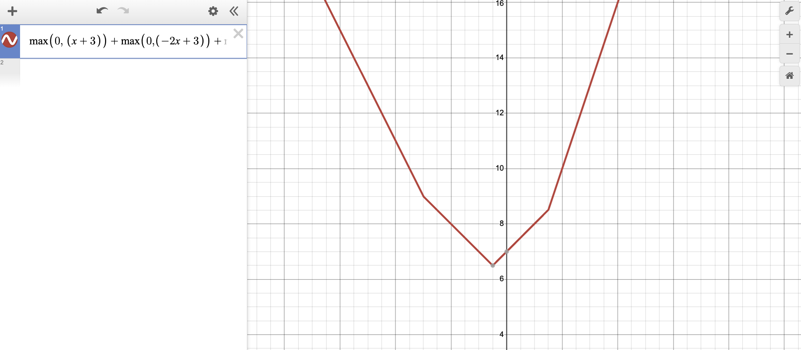

# Deep Neural Networks

> Learning Resource: [Understanding Deep Learning](https://udlbook.com/) Chapter 3.X

### 4.1

With $ReLU$ activations, both shallow and deep neural networks can essentially be described as a combination of multiple piecewise activations ($ReLU$) to form a single linear piecewise function that maps the input $x$ to output $y$.

 
<em> Multiple ReLU activations, summed</em>

 

Though, a shallow neural network will take more hidden units, $h_i \in H$, to compose the same function, $f$, that can be done with a deep neural network with a smaller set of $H$.

> *Follows that deep neural networks can approximate functions more efficiently, modeling complex relationships in a hierarchical manner with less total hidden units.*

### 4.3 

Deep Neural Networks are combinations of shallow neural networks:

$y = f_3(W_3 \cdot f_2(W_2 \cdot f_1(W_1 x + b_1) + b_2) + b_3)$

where $f$ is an arbitrary activation function.

Note that $W$ and $x$ are vectorized (see 4.4 in the book)

If not, equation would look as:

$y_i = f_3 \left( \sum_{j=1}^{3} w_{ij}^{(3)} \cdot f_2 \left( \sum_{k=1}^{3} w_{jk}^{(2)} \cdot f_1 \left( \sum_{l=1}^{3} w_{kl}^{(1)} x_l + b_{k}^{(1)} \right) + b_{j}^{(2)} \right) + b_{i}^{(3)} \right)$

> i'm not writing the full thing out lol. you get the gist.

### 4.4

Modern neural networks have over hundreds of layers, they're extremly deep.

Their number of layers, $K$, and hidden units at a given layer, $D_k$ can be extremely large.

Both $K$ and $D_k$ are hyperparameters, that define the network width and depth, ultimately, the capacity (denoted by total hidden units).

Each set of hidden units can describe a given family of functions, $f \in \set{\mathcal{F}}$. Considering the hyperparameters that are defined, neural networks represent a family (denoted by hyperparams) of families of functions (denoted by hidden units) that relate the input to the output.

### 4.5

A deep neural network can approximate a different family of functions than a shallow neural network, given the introduction of a non-linearity such as $ReLU$. Of course, if the activation function $a ≠ ReLU$ and was instead purely a linear mapping, then the deep network could be reduced to a shallow model, given the linear dependency. 

> *no need for excessive transformations if they are al linear. **they add no unique information!** learn linalg!*

The extra layers would not add new information that maps the output from the first layer to the output in the 3rd layer via the second layer. You coudl just reduce the network to a single shallow layer.

Deep neural networks can also create a larger family of functions and convex polygonal regions when compared to shallow neural networks, with a smaller number of parameters / hidden units. The prior equation, $R_n(m) = \sum_{j=0}^{n}\begin{pmatrix}m \\ j\end{pmatrix}$ may not be as reliable, when approximating the maximumal number of polygonal regions that the model can create via it's hyperplanes (hidden units), given the introduction of non-linearities and the increasingly complex functions it can approximate.

Deep models, despite being able to approximate broader family of complex functions, they also have greater dependencies and symmetries given that the hidden units are more interconnected. This might not be an advantage unless the underlyign data does have complex dependencies / symmetries that we might want to approximate. If the underlyign data can be thought of beign composed of simpler interconnected functions, then perhaps the deeper the better.

Deeper models may also have the advantage of being eaiser to train, given that they approximate a larger family of functions, it's likely that there exists multiple instances of parameters that yield near similar minima in the loss function, $\mathcal{L}$. There comes a point where deeper models can become damaging (vanishing gradients) but can be solvable via residual connections.

Fully connected models aren't always better when it comes to very large and strucutred inputs. Consider a $256\times256$ RGB image. That amounts to near $~200,000$ input pixels, an input vector $\vec{x}$ of that magnitude. It becomes impractical to have an insanely large number of parameters, $\Omega$, when you could compute a hypothesis about the structure of all $\vec{x} \in \set{X}$ using a smaller set of weights. But for this, you need deeper layers to be able to extract meaningful information, given that hypothesis set of parameters, $\hat{\Omega}$ doesn't or may not fully map the input to output, as $\hat{\Omega}$ no longer denotes a fully connected network (see convolutions).