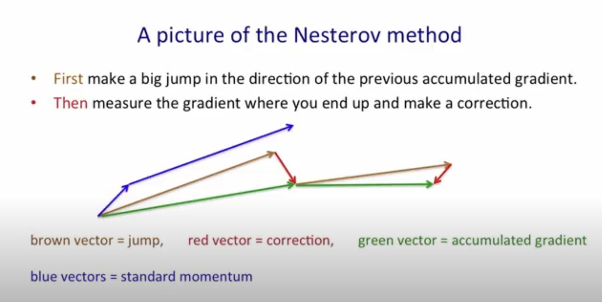

## Momentum

> [NumPy Implementation](implementations/01-npmomentum.py)
>
> [PyTorch Implementation](implementations/01-pytorch-momentum.py)

Momentum is the means for adding 'velocity' to gradient descent.

Given a gradient, $g_t = \frac{1}{n} \sum_{i\in n} \frac{∂L(x_i, w_{t-1})}{∂w_{t-1}}$, computed across all $T$ iterations, the optimization path along the loss surface $L$ is prone to be very stochastic with a high amount of variance.

To approach this issue, we can implement a type of variance reduction using a 'leaky average' or exponentially weighted average.

Exponentially weighted average are essentially computed as:

$V_t = \beta V_{t-1} + ( 1 - \beta ) \theta_t$

where $\beta$ is the smoothign factor and $\theta$ is the value at the current time steps.

Over multiple iterations, the formula replaces a given value of $\theta$ with $V$, a value that considers not only $\theta_t$ but previous values of $\theta$, $\theta_{t-n}$ where $n>0$, with exponentially decaying weights for earlier $\theta$ values as iterations go on.

For a time step $t$, as we move away from $t$, each older value, $V_{t}$ will have a decreased weight, as new values are constnatly being overshadowed by values of $\theta$ at the current $t$.

We apply the same principle to our gradients,as:

$v_t = \beta v_{t-1} + (1 - \beta) g_t$

where $g_t$ is the gradient at the current time step.

Then in the update rule, 

$w_t = w_{t-1} - \alpha g_t$

$g_t$ becomes $v_t$ as,

$w_t = w_{t-1} - \alpha v_t$

where the velocity term, $v$, provides an averaged gradient given by the exponentially weighted average.

Thereby, there is less variance in the optimization path. It's more direct, and *accelerated*.

The choice of $\beta$ matters, it's an important hyperparameter.

For large values of $\beta$, previous gradients will have more importance over the gradient at the $t$ time step. 

For smaller values of $\beta$, current gradients will have more improtance over the past gradients.

Note that the parameter, $(1 - \beta)$ can be considered a dampening parameter. In the original paper for momentum, $1 - \beta$ was the default choice for the parameter. In modern implementations, we can set the custom dampening parameter to a different value such as $\gamma$, which then gives us more control over the dampening as:

$v_t = \beta v_{t-1} + (1 - \gamma) g_t$

The smaller $\gamma$ is, the larger the velocity term will be and therefore the gievn model will train faster.

## Nesterov Momentum

> [NumPy Implementation](implementations/02-np-nesterov.py)
> 
> [PyTorch Implementation](implementations/02-pytorch-nesterov.py)

Nestorv momentum, is similar to traditional momentum, with a slight change to computing the weight update.

As in prior momentum, we did:

$v_t = \beta v_{t - 1} + (1 - \beta) \frac{∂L}{∂\theta}$

$\theta = \theta -  \alpha v_t$

Nestorov introduces 'look ahead' via an intermediate update, utilizing only the historical velocity terms, prior to calculating the real gradient.

$v_t = \beta v_{t-1}$

$\hat{\theta} = \theta - \alpha v_t$

Compute -- $\frac{∂L}{∂\theta}$

$v_t = (1 - \beta)\frac{∂L}{∂\theta}$

$\theta = \theta - \alpha v_t$

<br/>
<div align = 'center'>

</div>
<br/>

Rather than coupling together the gradient update with the velocity term, we *decouple* their influence into 2 steps.

First we update the parameters $\theta$, to $\hat{\theta}$, an interim update, and then compute the the gradient with respect to the loss function $L$. 

Only after we have taken this interim step, we comute the gradient, and then apply the update as $\theta = \theta - \alpha(1 - \beta)\frac{∂L}{∂\theta}$.

This gives the optimizer a type of lookahead, where we first update on the velocity (or historical averaged gradients if you must), and then error-correct any mistake the update made using the real gradients at that step.

*The same thing as noted prior can be done with the dampening paramter:*

$v_t = \beta v_{t-1} + (1 - \gamma) g_t$

Using $1 - \gamma$ instead of the original $(1 - \beta)$

## Adagrad

> [NumPy Implementation](implementations/03-np-adagrad.py)
> [PyTorch Implementation](implementations/03-pytorch-adagrad.py)

<br/>

<br/>
<br/>

Adagrad introduces the concept of an adaptive learning rate, adapting the learning rate for each feature, assigning a higher learning rate for infrequent features and lower learning rates for frequent features, based on the accumulated squared gradients.

The update rule is given as:

$\theta = \theta - \alpha G_t^{-1/2} \cdot g_t$

where $G_t^{-1/2}$ is the inverse of the square root of $G_t$.

$G_t$ is essentially the sum of the outer products of the gradients until time-step $t$, denoted as:

$G_t = \sum_{\tau = 1}^t g_{\tau}g_{\tau}^T$

where $\tau$ is the current time step. We're essentially accumulating all the previous gradients at all previous time steps, $\tau$, to effectively adapt the learning rate.

The matrix, $G_t$ can be simplified to a diagonal matrix, $diag(G_t)$, to avoid unneccesary computation when taking it's square root as $\sqrt{G_t}$ (or $G_t^{-1/2}$).

Then, $diag(G_t)$ can simply be reduced to the element wise square of $g_t$.

$diag(G_t) \rightarrow g_t^2$

as the $diag(G_t)$ or the diagonal of the outer product of the gradient vector, $g_t$ is simply the element wise squared vector of $g_t$.

Then the update rule can simply become a hadamard product ($\odot$) rather than a dot product ($\cdot$).

$\theta = \theta - \frac{\alpha}{\sqrt{\epsilon + g_t^2}} \odot g_t$

where $\epsilon$ is a small number to avoid division by $0$.

Then accumulating the gradients becomes the simple formulation:

$s_t = s_{t-1} + g_t^2$

The more frequent your feature is, the larger your gradient accumulation will be, as you'll have taken a larger $\frac{∂L}{∂\theta}$ for the specific $\theta$ that activates for the specific feature.

The more a given $\theta$ has been updated, meaning where the $g_t$ has been non-zero, the greater the accumulation of gradients ($g_t^2$) for the given $\theta$ will be. Thereby, when scaling down via $\sqrt{\epsilon + s_t}$, the $\odot$ with $g_t$ will result in unique learning rates, smaller for those parameters that have been frequently updated and larger for those that have been infrequently updated.

## RMSProp

> [NumPy Implementation](implementations/04-np-rmsprop.py)
>
> [PyTorch Implementation](implementations/04-pytorch-rmsprop.py)

An issue with adagrad is the constant scaling down of a learning rate for parameters with high gradient accumulation. 

An edge case that can damage the optimization process is, if a neuron has consistently high gradients and does not cease to have a high gradient over $t$ epochs, the learning rate still scales down over the $t$ epochs despite the neuron having a high gradient and not effectively learning.

Thereby, the neuron receives smaller updates over $t$ epochs and will not properly adjust at the right pace it needs to, despite having a high gradient.

Over enough epochs, the neuron can essentially become frozen.

RMSProp solves this problem by, just as was done in momentum, introducing a leaky average or exponentially weighted average.

Rather than:

$s_t = s_{t-1} + g_t^2$

we have:

$s_t = \gamma s_{t - 1} + (1 - \gamma)g_t^2$

which averages the gradients, putting an exponentially decrasing weighted emphasis on the past gradients, denoted by the accumulation of the squared gradients, $s_{t-1}$.

This solves the issue with adagrad by stablizing the past gradients around the more recent gradients rather than continuously (and unboundedly) accumulating gradients via the plain $s_t = s_{t-1} + g_t^2$

The entire algorithm is then:

$s_t = \gamma s_{t-1} + (1 - \gamma) g_t^2$

$\theta = \theta - \frac{\alpha}{\sqrt{s_t + epsilon}} g_t$

## Adadelta

> [NumPy Implementation](implementations/05-np-adadelta.py) (BROKEN!)
>
> [PyTorch Implementation](implementations/05-pytorch-adadelta.py)

Adadelta is formulated similarly to RMSProp, in the aspect that it makes use of an adaptive learning rate per dimension of a given layer.

Just like RMSprop, it aims to solve the issue with Adagrad of an unbounded increase in gradient accumulation and an unbounded decrease in the learning rate for certain parameters of a neural network.

$s_t = (\gamma s_{t-1}) + (1 - \gamma)g_t^2$

The difference, betwen Adadelta and RMSprop is that Adadelta requires no explicit learning rate to be set as a hyperparameter. It instead automatically computes the learning rate, based on previous parameter updates and the squared gradient iteself.

First we comute the gradient:

$g_t = \frac{∂L}{∂\theta_t}$

Then, as before we can take the leaky average of the squared gradient:

$s_t = (\gamma s_{t - 1}) + (1 - \gamma)g_t^2$

Now rather than applying $s_t$ directly to $\alpha$ as done in RMSprop, we seperately compute the weight update (or rescaled gradient, $g_t$) without an explicit $\alpha$ as:

$g_t' = - \frac{\sqrt{\Delta\theta_{t-1} + \epsilon}}{\sqrt{s_t + \epsilon}}g_t$

where $\Delta\theta$ is purely the leaky average of the squared previous rescaled gradients / weight updates:

$\Delta\theta = (\gamma\Delta\theta_{t-1}) + (1 - \gamma)g_t'^2$

> Note that squaring the gradients is extremely important, to avoid a square root by a negative value. We want the RMS!

And the final weight updates are simply:

$\theta_t = \theta_{t-1} + g_t'$

Again, same benefits as RMSProp, except without the need for an explicit learning rate, reducing a need for additional hyperparameter tuning or learning rate scheduling.

## Adam

> [NumPy Implementation](implementations/06-np-adam.py)
>
> [PyTorch Implementation](implementations/06-pytorch-adam.py)

Adam is an optimizer that combines all the beneifts previous optimizers, RMSProp, Momentum, and Adagrad, into a single recipe for learning.

Adam makes use of both a first moment and second moment esimate.

First moment is defined as:

$v_t = \beta v_t + (1 - \beta) g_t$

calculated the same as momentum.

Second moment is defined as:

$s_t = \beta s_t + ( 1 - \gamma ) g_t^2$

where $g_t$ is simply $\frac{∂L}{∂\theta}$

For both $s_t$ and $v_t$, the original Adam paper defines a bias correction as:

$s_t = \frac{s_t}{1 - \beta^t}$

$v_t = \frac{v_t}{1 - \gamma^t}$

where $t$ is the current time step. This bias correction prevents the exponential weighted average of both the 1st and second moments to be biased to $0$.

The update rule is then defined as:

$\theta = \theta - \frac{\alpha}{\sqrt{s_t + \epsilon}} v_t$

It's one of the more widely used optimizers to date.

## AdamW

> [NumPy Implementation](implementations/07-np-adamw.py)

AdamW addresses the distinction between $L2$ regularization and weight decay in the Adam optimizer.

In stochastic gradientd descent, $L2$ regularization can be defined as:

$\mathcal{L}(\theta, y)_{reg} = \mathcal{L}(\theta, y) + \frac{\lambda}{2}||w||^2$

applied directly to the loss function, $\mathcal{L}$, and then computed in many gradients, typically as:

$g_t = \frac{∂L}{∂\theta} + \lambda w$

weight decay on the other hand, in SGD, is directly in the weight update as:

$\theta = \theta - \alpha g_t + \alpha \lambda w_t$ (1)

$\theta = \theta - \alpha (g_t + \lambda w_t)$ (2)

where:

$\alpha$ is the learning rate and $\lambda$ is the regularization / weight decay parameter, which controls the strength of the regularization / weight decay.

In SGD, weight decay and $L2$ regularization are essentially equivalent, providing the same effect no matter which you use.

Note that in equation $(1)$, we're essentially just addding on the regularization parameter onto the gradient as, $g_t + \lambda w_t$, equivalent to the original gradient calculation $g_t$.

So $L2$ regularization ends up having the same effect as weight decay.

But in Adam, we compute the first and second moments to add **momentum** and adapt the **learning rate** per dimension at a given layer of a neural network, **prior** to the weight update.

```math
g_t = \frac{∂\mathcal{L(\theta, y)}}{∂\theta}\\[4mm]
v_t = \beta v_t + (1 - \beta) g_t \\[4mm]
s_t = \beta s_t + (1 - \beta) g_t^2\\[4mm]
\theta = \theta - \frac{\alpha}{\sqrt{s_t + \epsilon}}v_t
```

If we add $L2$ regualrization, we'd do as:

```math
g_t = \frac{∂\mathcal{L(\theta, y)}}{∂\theta} + \lambda w_t\\[4mm]
v_t = \beta v_t + (1 - \beta) g_t \\[4mm]
s_t = \beta s_t + (1 - \beta) g_t^2\\[4mm]
\theta = \theta - \frac{\alpha}{\sqrt{s_t + \epsilon}}v_t
```

but if we add weight decay to Adam, we'd compute as:

```math
g_t = \frac{∂\mathcal{L(\theta, y)}}{∂\theta}\\[4mm]
v_t = \beta v_t + (1 - \beta) g_t \\[4mm]
s_t = \beta s_t + (1 - \beta) g_t^2\\[4mm]
\theta = \theta - \alpha(\frac{v_t}{\sqrt{s_t + \epsilon}} + \lambda w_t)
```

There's clearly a difference, L2 regularization affects the computation of the first and second moments while weight decay doesn't and purely scales down the gradients.

$L2$ regularization is not as effective in Adam, when applied to the first and second moments, prior to the weight update, the regularizing effect diminishes, as you're using an **averaged** set of gradients (given the leaky average of the first and second moments) to perform the weight update rather than directly using the original weight magnitude with $\lambda$ to regularize $\theta$.

But in weight decay, we use the magnitude of weights directly to regularize in the weight update, and **they aren't** averaged, instead added directly, leading to stronger regularization.

Per the authors of the [paper](https://arxiv.org/pdf/1711.05101v3):

*With L2 regularization both types of gradients are normalized by their typical (summed) magnitudes, and therefore weights $x$ with large typical gradient magnitude s are regularized by a smaller relative amount than other weights. In contrast, decoupled weight decay regularizes all weights with the same rate $λ$, effectively regularizing weights $x$ with large $s$ more than standard L2 regularization*

The proposal for AdamW is to simply just decouple $L2$ regualrization and purely use weight decay as:

$\theta = \theta - \alpha(\frac{v_t}{\sqrt{s_t}} + \lambda \theta)$

## Nadam

Nadam, to make long things short, simply aims to concatenate the benefits of Adam and Nesterov Momentum.

Rather than computing the first moment estimate as a simple leaky average of the gradients, Nadam adds a look ahead, just as Nesterov momentum did, using the past gradients for the interim weight update and the true gradients for the error-correction in the second weight update.

We compute as:

```math
v_t = \beta v_{t-1} + (1 - \beta_1) g_t \\[3mm]
s_t = \beta s_{t-1} + (1 - \beta_2) g_t^2 \\[3mm]
\hat{v_t} = \frac{v_t}{1 - \beta_1}\\[3mm]
\hat{s_t} = \frac{s_t}{1 - \beta_2}\\[3mm]
g_{t+\frac{1}{2}} = g_t + \beta_1\hat{v_t} \\[3mm]
\theta = \theta - \frac{\alpha}{\sqrt{\hat{v_t} + \epsilon}} g_{t+\frac{1}{2}}
```


